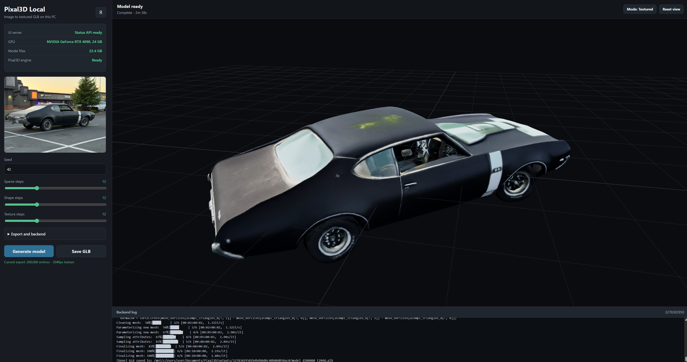

# Pixal3D Local UI

A local Windows wrapper for TencentARC Pixal3D. It provides an HTML page for image upload, generation settings, Three.js GLB preview, and downloading the generated textured `.glb` model.

## Screenshots



<p align="left">
  
  
</p>

## Quick Start

1. Download or clone this repository.
2. If you downloaded a ZIP archive, extract the whole archive first. Do not run the project from inside the ZIP file.
3. Open the project folder in Windows File Explorer.
4. Double-click:

```bat
START_PIXAL3D.bat
```

The BAT file starts a PowerShell helper that checks dependencies, installs missing tools when possible, prepares the project, starts the local server, and opens the HTML page in your browser.

## Which Mode To Choose

When `START_PIXAL3D.bat` starts, it shows this menu:

```text
1 - Full setup and launch with 3D generation
2 - Quick launch of the web UI only
3 - Exit
```

Choose `1` if you want real Pixal3D model generation. The first full setup can take a long time because it needs WSL, an NVIDIA GPU, a CUDA backend, and large model files.

Choose `2` if you only want to open the local page quickly and check the interface. The page will open, but 3D generation will not work until the WSL/CUDA backend is ready.

## What The Launcher Installs

`START_PIXAL3D.bat` checks and installs these items when needed:

- Git, used to download the official Pixal3D and TRELLIS.2 sources into `vendor/`.
- Python 3.10 or newer, used by the local FastAPI server. The launcher installs Python 3.12 when a usable Python is missing.
- Node.js LTS / npm, used to install the Three.js viewer dependency.
- Python virtual environment `.venv`.
- Python dependencies from `requirements-app.txt`.
- npm dependencies from `package.json`.
- `vendor/Pixal3D` and `vendor/TRELLIS.2`.

When full mode is selected, it also prepares:

- WSL / Ubuntu.
- Linux packages such as build tools, git-lfs, ninja, and libjpeg.
- Miniforge.
- Conda environment `pixal3d`.
- PyTorch CUDA, Pixal3D/TRELLIS dependencies, and CUDA extensions.
- Local model files in `models/`.

The main Pixal3D checkpoint is about 23 GB. With helper models, Python/Conda environments, and WSL files, keep about 80-100 GB of free disk space available.

## User Input During Setup

The launcher explains each step, but these are the common prompts a beginner may see:

- Windows may ask for administrator permission. This is needed when installing tools through `winget` or installing WSL. Click `Yes`.
- If WSL/Ubuntu starts for the first time, it asks you to create a Linux user. Type a simple lowercase name, for example `pixal`, and press Enter.
- Ubuntu then asks for a password. Create a password, press Enter, then type the same password again. The password characters are invisible while you type; that is normal.
- If you later see `[sudo] password`, type the same Ubuntu password.
- If Windows asks you to reboot after WSL installation, reboot the computer and run `START_PIXAL3D.bat` again.

## Requirements For Full 3D Generation

The web interface only needs Windows, Python, and Node.js.

Real Pixal3D generation needs:

- Windows 10/11 with WSL.
- An NVIDIA GPU.
- A recent NVIDIA Driver, with `nvidia-smi` working in Windows.
- Enough free disk space.
- A stable internet connection for downloading models and dependencies.

If the computer does not have an NVIDIA GPU, the UI can still open, but generation will fail because Pixal3D requires CUDA.

## Manual Commands

Normal beginner launch:

```bat
START_PIXAL3D.bat
```

Start directly in full mode:

```bat
START_PIXAL3D.bat -Mode Full
```

Start directly in quick UI-only mode:

```bat
START_PIXAL3D.bat -Mode Quick
```

Start without the safe repository update step:

```bat
START_PIXAL3D.bat -NoUpdate
```

Start the server without opening a browser:

```bat
START_PIXAL3D.bat -NoBrowser
```

The older direct PowerShell launch still works:

```powershell
.\launch.ps1
```

## Safe Auto-Update

If the project was downloaded through Git and the folder has no local changes, the launcher runs:

```powershell
git pull --ff-only
```

This is a safe update mode. It does not overwrite your local changes. If the folder contains modified files, the update step is skipped and the launch continues with the current files.

## Project Structure

- `START_PIXAL3D.bat` - the beginner-friendly entry point.
- `scripts/start-for-beginners.ps1` - the detailed helper that installs dependencies and explains required actions.
- `launch.ps1` - starts the local server and opens the browser.
- `scripts/setup-app.ps1` - prepares the Windows web UI environment.
- `scripts/install-wsl.ps1` - installs WSL through an elevated PowerShell window.
- `scripts/setup-wsl-backend.ps1` - prepares the WSL/CUDA backend.
- `scripts/download-models.ps1` - downloads model files separately.
- `app/server.py` - FastAPI server.
- `app/pixal3d_runner.py` - Pixal3D inference/export runner.
- `static/` - HTML/CSS/JS interface.
- `models/` - local model snapshots after download.
- `outputs/` - generated results.
- `uploads/` - uploaded input images.
- `vendor/` - official Pixal3D and TRELLIS.2 sources.

## Where To Find Errors

If the page does not open or the backend fails, check:

- `engine/server.out.log`
- `engine/server.err.log`
- `outputs/<job-id>/run.log`

If the error happened during WSL setup, the most useful message is usually printed directly in the launcher window.

## Optional RMBG-2.0 Background Remover

The default setup uses the public `ZhengPeng7/BiRefNet` model. `briaai/RMBG-2.0` is a gated Hugging Face model and requires access approval on Hugging Face.

After access is approved, download RMBG-2.0 manually:

```powershell
.\.venv\Scripts\hf.exe auth login
.\.venv\Scripts\hf.exe download briaai/RMBG-2.0 --local-dir .\models\RMBG-2.0
.\.venv\Scripts\python.exe .\scripts\download_models.py --skip-existing
```

The last command updates `models/Pixal3D/pipeline.json` to use `models/RMBG-2.0` when that folder exists.
